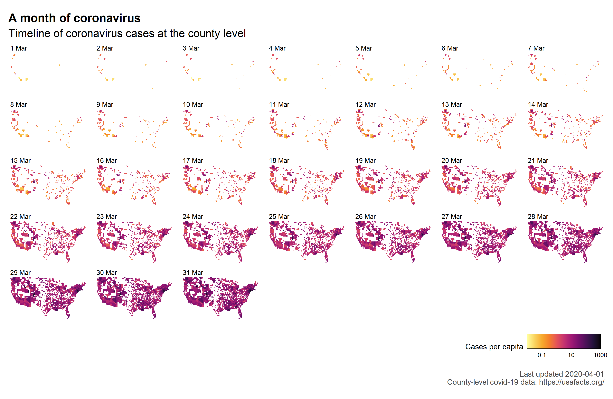
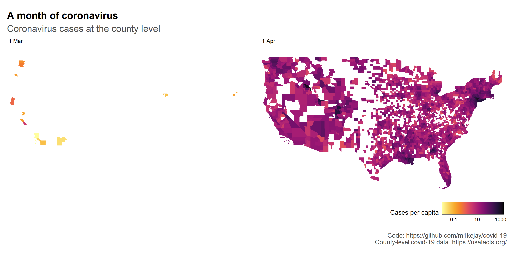

```{r init, include = FALSE}

knitr::opts_chunk$set(
  fig.retina = 2,
  message = FALSE,
  warning = FALSE,
  useDingbats = FALSE
)
```


This analysis is a brief look at the covid-19 data. 

# Importing and cleaning data

Let's begin by loading packages necessary for the analysis conducted here:

```{r message=FALSE, warning=FALSE}
# Libraries used in this analysis

library(sf) # Mapping
library(tigris) # Mapping 
options(tigris_use_cache = TRUE)
options(tigris_class = "sf")
library(rvest) # For pulling data from wikipedia
library(tidyverse) # Tidying data
library(patchwork) # For plotting graphs together
library(lubridate) # Working with dates
library(here) # Easier file referencing
library(glue) # Alternative to paste0
library(colorspace) # Colour palettes
library(countrycode) # Get country codes to help de-clutter plots
library(cowplot) # Organising multiple plots 
library(gghighlight) # Highlight subsets
library(ggtext) # Richer text formatting
library(ggrepel) # Repel labels in plots
library(gtable) # To reconstruct ggplots
library(grid) # To help reconstruct ggplots
library(wbstats) # Useful for getting GDP stats
```


Before we can do any plotting, we of course have to import the data and do a little bit of tidying. The covid-19 data comes from John Hopkins' github repository here: https://github.com/CSSEGISandData/COVID-19/.

```{r data-import}
# location of data
data_url_prefix <- "https://raw.githubusercontent.com/CSSEGISandData/COVID-19/master/csse_covid_19_data/csse_covid_19_time_series/time_series_covid19_"

# case/file nmaes
case_type <- c("confirmed", "deaths")

# date regex for the pivot longer call
date_regex <- "^\\d{1,2}\\/\\d{1,2}\\/\\d{2,4}"

# Map across case_type and concatenate data into one dataframe
df <- map_dfr(
  case_type,
  ~ read_csv(glue(data_url_prefix, ., "_global.csv")) %>%
    mutate(case_type = .x) %>%
    select(case_type, everything())
) %>%
  pivot_longer(
    # Pivot by date
    cols = matches(date_regex),
    names_to = "date",
    values_to = "cases"
  ) %>%
  # quick clean of columns
  janitor::clean_names() %>%
  rename(
    "province" = "province_state",
    "country" = "country_region"
  ) %>%
  # Remove cruise ship data
  filter(!(country %in% c("Diamond Princess", "MS Zaandam"))) %>%
  # Data is split by provinces/states, so each country has multiple rows.
  # I'm not interested in *within* country variation, so group by country/day and sum cases
  group_by(case_type, country, date) %>%
  summarise(cases = sum(cases)) %>%
  ungroup() %>%
  group_by(case_type, country) %>%
  mutate(
    date = mdy(date),
    n_days = date - max(date),
    continent = countrycode(sourcevar = country, origin = "country.name", destination = "continent"),
    country_code = countrycode(sourcevar = country, origin = "country.name", destination = "iso2c"),
    # Fix Kosovo
    country_code = if_else(country == "Kosovo", "XK", country_code),
    continent = if_else(country == "Kosovo", "Europe", continent)
  ) %>%
  ungroup()

# Write and read csv back in
file_name <- here(glue("data/covid_19_{Sys.Date()}.csv"))
write_csv(df, file_name)

# Redefining na  so NA gets encoded as the country_code for Namibia
df <- read_csv(file_name, na = "NaN")
df
```

This code block takes the raw data from github and does a few key things:

* By using `map_dfr()`, it takes the two files, `time_series_covid19_confirmed_global.csv` and `time_series_covid19_deaths_global.csv`, and binds the data together into one dataframe.
* Converts the new dataframe from wide to long format.
* Removes the 'Diamond Princess' (cruise ship) data. 
* Aggregates across each country/day the number of cases. 
* Finally it introduces two new variables: `continent` and `country_code` (using the `countrycode` package) which I can then use for plotting purposes and pulling in statistics from worldbank (toward the end of this analysis)

# Some plotting

Now we can move onto plotting the data...

## Confirmed cases

```{r fig.height = 6, fig.width = 7}
# Define caption whicch I'll put on all my graphs
custom_caption <- glue("Last updated {Sys.Date()}\nData: https://github.com/CSSEGISandData/COVID-19/")

# Pull country with max cases for africa
# max_africa <- df %>%
#   filter(continent == "Africa", case_type == "confirmed") %>%
#   filter(cases == max(cases)) %>%
#   pull(country)

days_vs_confirmed <-
  df %>%
  filter(case_type == "confirmed") %>%
  group_by(country) %>%
  filter(cases > 0) %>%
  mutate(dummy_min = -as.numeric(min(n_days))) %>%
  filter(cases == max(cases), n_days == max(n_days)) %>%
  ungroup() %>%
  group_by(continent, country, dummy_min) %>%
  summarise(cases = sum(cases)) %>%
  ungroup()

days_vs_confirmed %>%
  ggplot(aes(x = dummy_min, y = cases)) +
  geom_point(col = "#CCCCCC") +
  geom_point(
    data = days_vs_confirmed %>% filter(country %in% c("US", "China", "Iran")), 
    col = "darkred"
    ) +
  scale_y_log10(
    breaks = c(1, 10, 100, 1000, 10000, 100000),
    labels = scales::label_comma(accuracy = 1)
  ) +
  scale_x_continuous(
    breaks = seq(0, 100, 10)
  ) +
  theme_minimal() +
  theme(
    aspect.ratio = 1,
    panel.grid.minor = element_blank(),
    plot.caption = element_text(colour = "grey45")
  ) +
  facet_wrap(continent ~ .) +
  geom_label_repel(
    data = days_vs_confirmed %>% filter(country %in% c("US", "China","Iran")),
    aes(label = country),
    size = 3,
    label.size = NA,
    fill = "#FFFFFF",
    label.padding = unit(0.1, "cm"),
    ylim = c(2.5, NA) # This is hacky and only works with current data... Trying to resolve overlap with data
  ) +
  labs(
    title = "Cases vs days since first confirmed cast",
    subtitle = "Total number of confirmed cases against the number of days since first confirmed case",
    x = "Days since first confirmed case",
    y = "Total confirmed cases",
    caption = custom_caption
  )
```

So we can see some correlation between the number of days since the first case for a given coutnry and the total number of cases. 

Next let's make a lollipop chart so we can better appreciate cases on a country-by-country basis:


```{r fig.height = 11.5, fig.width = 8}
# Minor breaks for log-scale axis grid
minor_breaks <- rep(1:10, 31) * (10^rep(0:30, each = 30))


df %>%
  group_by(country) %>%
  filter(case_type == "confirmed", cases > 0) %>%
  mutate(dummy_min = -as.numeric(min(n_days))) %>%
  filter(cases == max(cases), n_days == max(n_days)) %>%
  ungroup() %>%
  arrange(desc(cases)) %>%
  slice(1:75) %>%
  ggplot(aes(x = cases, y = fct_reorder(country, cases))) +
  geom_segment(aes(
    x = 0,
    xend = cases,
    y = fct_reorder(country, cases),
    yend = fct_reorder(country, cases),
    colour = dummy_min
  ), size = 1.25) +
  geom_point(
    aes(x = cases, y = fct_reorder(country, cases), colour = dummy_min), 
    size = 3
    ) +
  scale_x_log10(
    name = "Number of confirmed cases (log scaled)",
    expand = c(0, 0),
    breaks = 10^seq(0, 10),
    labels = scales::label_comma(),
    minor_breaks = minor_breaks,
    limits = c(99.7, NA)
  ) +
  scale_y_discrete(
    name = ""
  ) +
  coord_cartesian(
    clip = "off"
  ) +
  scale_colour_continuous_sequential(
    name = "Number of days since\n first confirmed case",
    palette = "Greens",
    rev = TRUE,
    limits = c(0, NA)
  ) +
  labs(
    title = "Confirmed Cases of COVID-19",
    subtitle = "Number of cases for the 75 countries with the most confirmed cases of COVID-19",
    caption = custom_caption
  ) +
  theme_minimal() +
  theme(
    strip.text.y = element_text(angle = 0, hjust = 0),
    legend.position = "bottom",
    plot.margin = unit(c(1, 1, 1, 1), "cm"),
    legend.direction = "horizontal",
    legend.box.background = element_rect(fill = "#FFFFFF", colour = NA),
    panel.grid.minor = element_line(linetype = 1, color = "#F6F6F6"),
    panel.grid.major.y = element_blank(),
    plot.caption = element_text(colour = "grey45")
  ) +
  guides(
    colour = guide_colourbar(
      title.position = "top",
      title.hjust = 0.5,
      frame.colour = "#000000",
      draw.ulim = FALSE,
      draw.llim = FALSE,
      barwidth = unit(5, "cm")
    )
  ) +
  facet_grid(continent ~ ., space = "free", scales = "free_y")
```


Let's get a bird's eye view for all countries in the dataset:


 
```{r fig.height = 11, fig.width = 10.5}
# Mutate n_days so it makes more sense (to me)
correct_days <-
  df %>%
  filter(case_type == "confirmed") %>%
  filter(cases > 0) %>%
  group_by(continent, country_code) %>%
  mutate(
    n_days = n_days + abs(min(n_days)),
    n_days = as.numeric(n_days)
  ) %>%
  ungroup() %>%
  arrange(continent, country_code)

# Get distinct continent/country_code for labels/background
labels <-
  df %>%
  filter(case_type == "confirmed") %>%
  filter(cases > 0) %>%
  group_by(continent, country_code) %>%
  mutate(
    n_days = n_days + abs(min(n_days)),
    label = max(n_days) %>% as.numeric()
  ) %>%
  filter(n_days == max(n_days)) %>%
  select(continent, country, country_code, cases, label) %>%
  distinct() %>%
  ungroup() %>%
  arrange(continent, country_code)

# Max values for x/y labels
max_days <- max(correct_days$n_days)
max_cases <- max(correct_days$cases)

# X and Y title labels... This will need to be updated manually if new countries
# are added to dataset
ann_x <-
  tibble::tribble(
    ~continent, ~country_code, ~label, ~n_days, ~cases,
    "Europe", "RS", "Day", max_days / 2, 0L
  )
ann_y <-
  tibble::tribble(
    ~continent, ~country_code, ~label, ~n_days, ~cases,
    "Europe", "RS", "Cases", 0L, max_cases / 2
  )

# Define plot
p <-
  ggplot(data = correct_days) +
  # Background fill
  geom_rect(
    data = labels, 
    aes(fill = continent, alpha = ), 
    xmin = -Inf, 
    xmax = Inf, 
    ymin = -Inf, 
    ymax = Inf
    ) +
   # geom_line(
   #   data = correct_days %>% select(-continent, -country_code),
   #   aes(x = n_days, y = cases, group = country),
   #   colour = "#FFFFFF",
   #   alpha = 0.3
   # ) +
  # Total cases over time
  geom_line(
    aes(x = n_days, y = cases, group = 1), 
    colour = "#000000", 
    size = 0.5
    ) +
  # Country code in top left
  geom_text(
    data = labels,
    aes(x = 1, y = max_cases - max_cases*0.12, label = country_code),
    hjust = 0,
    vjust = 0,
    colour = "#FFFFFF",
    size = 3,
    fontface = "bold"
  ) +
  # Number of cases, top left
  geom_text(
    data = labels,
    aes(x = 1, y = max_cases - max_cases*0.3, label = scales::comma(cases)),
    hjust = 0,
    vjust = 0,
    colour = "#FFFFFF",
    size = 3,
    fontface = "bold"
  ) +
  facet_wrap(vars(continent, country_code), ncol = 14) +
  # Add y-axis values
  scale_y_continuous(
    breaks = c(0, max_cases),
    labels = scales::label_comma(),
    name = ""
  ) +
  # Add x-axis values
  scale_x_continuous(
    breaks = c(0, max_days),
    name = ""
  ) +
  # Define palette
  scale_fill_discrete_qualitative(
    palette = "Dynamic",
    name = ""
  ) +
  # Fine tune some visual elements
  theme(
    aspect.ratio = 1,
    strip.text.x = element_blank(),
    axis.title.x = element_blank(),
    axis.title.y = element_blank(),
    legend.position = "bottom",
    legend.direction = "horizontal",
    legend.justification = "right",
    panel.spacing = unit(0.1, "lines"),
    panel.grid = element_blank(),
    plot.caption = element_text(colour = "grey45"),
    plot.margin = unit(c(0, 0, 0, 1),"cm")
  ) +
  # Turn clipping off so we can get text outside the figure
  coord_cartesian(
    clip = "off"
  ) +
  # Add y-axis label
  geom_text(
    data = ann_y, aes(x = n_days, y = cases, label = label),
    hjust = 2,
    size = 3.5,
    colour = "grey15"
  ) +
  # Add x-axis label
  geom_text(
    data = ann_x, aes(x = n_days, y = cases, label = label),
    vjust = 3,
    size = 3.5,
    colour = "grey15"
  ) +
  # Add labels
  labs(
    title = "Total confirmed cases for each country",
    subtitle = "Number of confirmed cases from the day with the first confirmed case",
    caption = custom_caption
  ) 

# Function to filter out grobs
# https://stackoverflow.com/questions/36779537/ggplot2-facet-wrap-y-axis-scale-on-the-first-row-only/36780639#36780639
gtable_filter_remove <- function(x, name, trim = TRUE) {
  matches <- !(x$layout$name %in% name)
  x$layout <- x$layout[matches, , drop = FALSE]
  x$grobs <- x$grobs[matches]
  if (trim) {
    x <- gtable_trim(x)
  }
  x
}

# generate plot grob
p_grob <- ggplotGrob(p)

# Filter out unwanted facet labels
# This will also require manually updating if new countries are added
p_filtered <- gtable_filter_remove(p_grob, name = paste0("axis-l-", 1:12, "-1"), trim = FALSE)
p_filtered <- gtable_filter_remove(p_filtered, name = paste0("axis-b-", 2:14, "-12"), trim = FALSE)
p_filtered <- gtable_filter_remove(p_filtered, name = paste0("axis-b-", 2:14, "-13"), trim = FALSE)

# Assign grob back to plot 
p_filtered_plot <- ggpubr::as_ggplot(p_filtered)
p_filtered_plot
```

Has there been any slow down in the number of new cases?

```{r}
daily_cases_all <-
df %>%
  select(case_type, country, date, cases, continent) %>%
  pivot_wider(
    names_from = case_type,
    values_from = cases
  ) %>%
  group_by(continent, country) %>%
  arrange(country, date) %>%
  mutate(new_cases = confirmed - lag(confirmed)) %>%
  ungroup() %>%
  group_by(date) %>%
  summarise(total_new_cases = sum(new_cases, na.rm = TRUE)) %>%
  ungroup()

daily_cases_all %>%
  ggplot(aes(x = date, y = total_new_cases)) +
  geom_col(fill = "#CCCCCC") +
  scale_x_date(
    date_labels = "%d %b",
    date_breaks = "7 day",
    expand = c(0, 0),
    limits = c(min(df$date), NA)
  ) +
  theme_minimal() +
  theme(
    panel.grid.minor = element_blank(),
    plot.caption = element_text(colour = "grey45")
  ) +
  labs(
    x = "Date",
    y = "Daily count",
    title = "Global cases",
    subtitle = "New cases on a daily basis",
    caption = custom_caption
  )
```


```{r fig.height = 3, fig.width = 10}
daily_cases_select <- df %>%
  select(case_type, country, date, cases, continent) %>%
  pivot_wider(
    names_from = case_type,
    values_from = cases
  ) %>%
  arrange(country, date) %>%
  group_by(country) %>%
  mutate(new_cases = confirmed - lag(confirmed)) %>%
  ungroup() %>%
  group_by(continent, date) %>%
  summarise(total_new_cases = sum(new_cases, na.rm = T))

ggplot() +
  geom_col(data = daily_cases_all, aes(x = date, y = total_new_cases), fill = "#CCCCCC") +
  geom_col(data = daily_cases_select, aes(x = date, y = total_new_cases, fill = continent)) +
  scale_x_date(
    date_breaks = "14 day",
    date_labels = "%d %b",
    expand = c(0, 0),
    limits = c(min(df$date), NA)
  ) +
  theme_minimal() +
  theme(
    aspect.ratio = 1,
    axis.text.x = element_text(angle = 90, vjust = 0.5, hjust = 0),
    panel.grid.minor = element_blank(),
    plot.caption = element_text(colour = "grey45"),
    legend.position = "none"
  ) +
  labs(
    x = "Date",
    y = "Daily count",
    title = "Novel cases on within each continent",
    caption = custom_caption
  ) +
  facet_wrap(continent ~ ., nrow = 1) +
  scale_fill_discrete_qualitative(
    palette = "Dynamic"
  )
```

```{r}
order <- rev(c("Oceania", "Africa", "Americas", "Europe", "Asia"))

daily_cases_select %>%
  ggplot(aes(x = date, y = total_new_cases, fill = fct_relevel(continent, order))) +
  geom_area(position = "fill") +
  theme_minimal()  +
  scale_x_date(
    expand = c(0, 0.1),
    date_breaks = "14 day",
    date_labels = "%d %b",
    limits = c(min(df$date), NA),
    name = "Date"
  ) +
  scale_y_continuous(
    labels = scales::label_percent(),
    expand =  c(0, 0.01),
    breaks = c(0, 0.5, 1),
    name = "Share of new cases"
  ) +
  scale_fill_discrete_qualitative(
    palette = "Dynamic",
    name = ""
  ) +
  theme(
    panel.grid.minor = element_blank()
  )
```


```{r}
daily_cases_select <- df %>%
  select(case_type, country, date, cases, continent) %>%
  pivot_wider(
    names_from = case_type,
    values_from = cases
  ) %>%
  filter(country %in% c("China", "Italy", "US")) %>%
  arrange(country, date) %>%
  group_by(country) %>%
  mutate(new_cases = confirmed - lag(confirmed)) %>%
  ungroup() %>%
  group_by(country, date) %>%
  summarise(total_new_cases = sum(new_cases, na.rm = T))

china_annotation <-
daily_cases_select %>%
  filter(country == "China", date == "2020-02-13")

ggplot() +
  geom_col(data = daily_cases_all, aes(x = date, y = total_new_cases), fill = "#CCCCCC") +
  geom_col(data = daily_cases_select, aes(x = date, y = total_new_cases, fill = country)) +
  geom_richtext(
    data = china_annotation,
    aes(x = date-19, y = total_new_cases+22000),
    label = "<span style='font-size:9pt'>**2020-02-13**
    <br style = 'display: block; content: ''; margin-top: 0'>
    China changes their
    <br style = 'display: block; content: ''; margin-top: 0'>
    diagnostic criteria</span>",
    colour = "#000000",
    hjust = 0,
    vjust = 1,
    fill = "#FFFFFF",
    label.colour = NA
  ) +
  scale_x_date(
    date_breaks = "7 day",
    date_labels = "%d %b",
    expand = c(0, 0),
    limits = c(min(df$date), NA)
  ) +
  theme_minimal() +
  theme(
    aspect.ratio = 1,
    axis.text.x = element_text(angle = 90, vjust = 0.5, hjust = 0),
    panel.grid.minor = element_blank(),
    plot.caption = element_text(colour = "grey45"),
    legend.position = "none"
  ) +
  labs(
    x = "Date",
    y = "Daily count",
    title = "Novel cases on a daily basis for select countries",
    caption = custom_caption
  ) +
  facet_wrap(country ~ .) +
  scale_fill_discrete_qualitative(
  )
```
### Cases per capita

```{r}
populations <- wb_data("SP.POP.TOTL", start_date = 2017) %>%
  select(iso2c, SP.POP.TOTL) %>%
  rename(
    pop = SP.POP.TOTL,
    country_code = iso2c
  )

cases_per_capita <-
correct_days %>%
  left_join(populations, by = "country_code") %>%
  filter(pop > 10^6, cases >= 10) %>%
  mutate(per_capita = 100000 * (cases/pop)) 

cases_per_capita %>%
  ggplot(aes(x = n_days, y = per_capita, group = country_code)) +
  geom_line(alpha = 0.7) +
  theme_minimal() +
  theme(
    aspect.ratio = 1
  ) +
  scale_y_continuous(
    name = "Cases per capita"
  ) +
  scale_x_continuous(
    name = "# days since first case"
  ) +
  # scale_y_log10(
  #   labels = scales::label_comma()
  # ) +
  facet_grid(. ~ continent)
```


### GDP vs. confirmed cases

We can see from above Africa has very few cases of covid-19. Could it be that perhaps poorer countries don't have the infrastructure or resources to test for covid-19? Let's see what GDP vs confirmed cases looks like:

```{r}
gdp <- wb_data("NY.GDP.PCAP.CD", start_date = 2017) %>%
  select(iso2c, NY.GDP.PCAP.CD) %>%
  rename(
    gdp = NY.GDP.PCAP.CD,
    country_code = iso2c
  )


df %>%
  left_join(gdp, by = "country_code") %>%
  filter(case_type == "confirmed") %>%
  group_by(country_code) %>%
  filter(cases == max(cases), n_days == max(n_days)) %>%
  ungroup() %>%
  ggplot(aes(x = gdp, y = cases)) +
  geom_point(aes(colour = continent)) +
  scale_y_log10(
    labels = scales::label_comma(accuracy = 1)
  ) +
  scale_x_log10(
    labels = scales::label_comma()
  ) +
  geom_smooth(method = "lm", colour = "#000000", se = FALSE) +
  theme_minimal() +
  theme(
    panel.grid.minor = element_blank(),
    aspect.ratio = 1,
    axis.text.x = element_text(angle = 90, hjust = 1, vjust = 0.5),
    legend.position = "none",
    plot.caption = element_text(colour = "grey45")
  ) +
  labs(
    title = "Number of cases vs GDP",
    x = "GDP (log scaled)",
    y = "Cases (log scaled)"
  ) +
  scale_colour_discrete_qualitative(
    palette = "Dynamic",
    name = ""
  )
```

```{r fig.height = 3, fig.width = 10}
df %>%
  left_join(gdp, by = "country_code") %>%
  filter(case_type == "confirmed") %>%
  group_by(country_code) %>%
  filter(cases == max(cases), n_days == max(n_days)) %>%
  ungroup() %>%
  ggplot(aes(x = gdp, y = cases)) +
  geom_point(aes(colour = continent)) +
  scale_y_log10(
    labels = scales::label_comma(accuracy = 1)
  ) +
  scale_x_log10(
    labels = scales::label_comma()
  ) +
  geom_smooth(method = "lm", colour = "#000000", se = FALSE) +
  theme_minimal() +
  theme(
    panel.grid.minor = element_blank(),
    aspect.ratio = 1,
    axis.text.x = element_text(angle = 90, hjust = 1, vjust = 0.5),
    legend.position = "none",
    plot.caption = element_text(colour = "grey45")
  ) +
  labs(
    title = "Number of cases vs GDP",
    x = "GDP (log scaled)",
    y = "Cases (log scaled)"
  ) +
  scale_colour_discrete_qualitative(
    palette = "Dynamic",
    name = ""
  ) +
  facet_wrap(. ~ continent, nrow = 1, scales = "free_y")
```


## covid-19 associated deaths

What's the death toll looking like?

```{r}
# Convert to wide format
df_wide_all <-
  df %>%
  select(case_type, country, date, cases, continent) %>%
  pivot_wider(
    names_from = case_type,
    values_from = cases
  ) %>%
  filter(deaths > 0)

# Which countries to highlight
labs <-
  df_wide_all %>%
  group_by(country) %>%
  filter(deaths == max(deaths)) %>%
  ungroup() %>%
  arrange(desc(deaths)) %>%
  slice(1:7)
  

# Convert countries to wide format for just countries to highlight
df_wide_most_deaths <-
  df %>%
  select(case_type, country, date, cases, continent) %>%
  pivot_wider(
    names_from = case_type,
    values_from = cases
  ) %>%
  filter(country %in% labs$country) %>%
  filter(deaths > 0)

ggplot() +
  geom_line(
    data = df_wide_all, 
    aes(x = date, y = deaths, group = country), 
    colour = "#CCCCCC"
    ) +
  geom_line(
    data = df_wide_most_deaths, 
    aes(x = date, y = deaths, group = country, colour = fct_reorder(country, deaths)),
    size = 1
    ) +
  #  geom_point(data = df_wide_most_deaths,  aes(x = date, y = deaths, group = country, colour = fct_reorder(country, deaths))) +
  theme_minimal() +
  theme(
    legend.position = "none",
    plot.margin = unit(c(1, 3, 1, 1), "lines"),
    plot.caption = element_text(colour = "grey45")
  ) +
  scale_y_continuous(
    limits = c(0, NA),
    expand = c(0, 0),
    sec.axis = sec_axis(~., breaks = labs %>% pull(deaths), labels = labs %>% pull(country))
  ) +
  scale_x_date(
    date_labels = "%d %b",
    date_breaks = "7 day",
    expand = c(0, 0),
    limits = c(min(df_wide_all$date), NA)
  ) +
  coord_cartesian(
    clip = "off"
  ) +
  scale_color_discrete_qualitative() +
  labs(
    title = "Number of deaths from COVID-19",
    x = "Date",
    y = "Total number of deaths"
  )
```

## Fatality rates

What is the fatality rate of COVID-19? Let's look at the number of deaths divided by the number of confirmed cases. This comes with many caveats. Most notably that the analysis is probably incorrect. See the following link for a discussion of how best to calculate fatality rates :https://www.worldometers.info/coronavirus/coronavirus-death-rate/#correct

```{r fig.height = 6, fig.width = 9}
# Find rates for each row
mortality_rates <-
  df %>%
  select(case_type, country, date, cases, continent) %>%
  pivot_wider(
    names_from = case_type,
    values_from = cases
  ) %>%
  filter(confirmed > 500) %>%
  mutate(mortality_rate = 100 * deaths / (confirmed)) %>%
  ungroup()

# Summarise data
summary_latest_mortality_rate <-
  mortality_rates %>%
  group_by(country) %>%
  filter(date == max(date)) %>%
  ungroup() %>%
  summarise(
    median_mort = median(mortality_rate),
    mean_mort = mean(mortality_rate),
    sd = sd(mortality_rate),
    se = sd / sqrt(n())
  )

# Which countries to highlight (arbitrary)
highlight_countries <- c("Italy", "Iran", "United Kingdom", "China", "US", "Spain", "Netherlands")

# Labels for highlighted countries
labs <-
  mortality_rates %>%
  group_by(country) %>%
  filter(date == max(date)) %>%
  ungroup() %>%
  arrange(desc(mortality_rate)) %>%
  filter(country %in% highlight_countries) %>%
  mutate(
    label = glue("  { country } ({ deaths } / { confirmed })")
  )


ggplot() +
  geom_line(
    data = mortality_rates, 
    aes(x = date, y = mortality_rate, group = country), 
    colour = "#CCCCCC"
    ) +
  geom_hline(
    yintercept = summary_latest_mortality_rate$median_mort, 
    linetype = 2, 
    size = 0.75
    ) +
  geom_line(
    data = mortality_rates %>% filter(country %in% highlight_countries),
    aes(x = date, y = mortality_rate, group = country, colour = country),
    size = 1
  ) +
  geom_point(
    data = mortality_rates %>% filter(country %in% highlight_countries) %>% filter(date == max(date)),
    aes(x = date, y = mortality_rate, group = country, colour = country),
    size = 2.5,
    shape = 21,
    fill = "#FFFFFF",
    stroke = 1.5
  ) +
  geom_label(
    aes(x = as.Date("2020-01-25"), y = (summary_latest_mortality_rate$median_mort - 0.39)), 
    label = "Median", 
    label.size = NA, 
    fill = "#FFFFFF", 
    label.padding = unit(0.1, "cm")
    ) +
  theme_minimal() +
  labs(
    title = "Fatality rate of COVID-19",
    subtitle = "Fatality rate (deaths / confirmed cases) on a daily basis for each country with 500+ confirmed cases",
    x = "",
    y = "Mortality rate (%)",
    caption = custom_caption
  ) +
  scale_x_date(
    expand = c(0, 0),
    date_breaks = "7 day",
    date_labels = "%d %b"
  ) +
  scale_y_continuous(
    limits = c(0, NA),
    breaks = 0:50,
    expand = c(0.01, 0.25),
    sec.axis = sec_axis(~., breaks = labs %>% pull(mortality_rate), labels = labs %>% pull(label))
  ) +
  coord_cartesian(
    clip = "off"
  ) +
  theme(
    legend.position = "none",
    panel.grid.minor = element_blank(),
    plot.caption = element_text(colour = "grey45")
  ) +
  scale_color_discrete_qualitative(palette = "Dark 3")
```

## Within the United States

```{r state-import}
# Import daily _state_ level
daily_state_cases  <-
  read_csv("http://covidtracking.com/api/states/daily.csv") %>%
  rowwise(state) %>%
  mutate(
    state_abb = state,
    state = state.name[grep(state, state.abb)[1]]
  )

#Extract and clean state information (interested in population mainly)
 state_info <-
"https://en.wikipedia.org/wiki/List_of_states_and_territories_of_the_United_States" %>%
  read_html() %>%
  html_node(xpath = '//*[@id="mw-content-text"]/div/table[2]') %>%
  html_table(fill = TRUE) %>%
  janitor::clean_names() %>%
  filter(row_number() != 1) %>%
  rename(
    state = flag_name_postal_abbreviation_12,
    state_abb = flag_name_postal_abbreviation_12_2,
    established = ratificationor_admission_c,
    pop = population_d_14,
    total_area = total_area_15,
    land_area = land_area_15,
    water_area = water_area_15
    ) %>%
  select(
    state,
    state_abb,
    established,
    pop,
    ends_with("_area")
    ) %>%
  mutate_at(
    .vars = c(4:7),
    ~ gsub(",(?)", "", .) %>% as.numeric
    ) %>%
  mutate(
    established = mdy(established),
    state = gsub("\\[[A-Z]\\]", "", state)
  )

write_csv(state_info, here("./data/state_info.csv"))
state_info <- read_csv(here("./data/state_info.csv"))

states_map <- st_as_sf(maps::map("state", plot = FALSE, fill = TRUE))

states_map_complete <-
  states_map %>%
  left_join(state_info %>% mutate(ID = str_to_lower(state)), by = c("ID")) %>% # Combine with state info (population levels etc..)
  left_join(daily_state_cases, by = "state") %>%                               # Combine with covid-19 cases data
  mutate(per_capita =  100000 * (positive/pop))                                # Calculate per cpaita information.

states_map_complete %>%
  filter(dateChecked == max(dateChecked)) %>%
  ggplot() +
  geom_sf(aes(geometry = geom, fill = per_capita), colour = "#FFFFFF") +
  scale_fill_continuous_sequential(
    trans = "log10",
    palette = "Greens"
  ) +
  geom_sf_text(data = states_map_complete %>% filter(state %in% c("New York", "Illinois", "Washington")),
               stat = StatSfCoordinates, 
               fun.geometry = sf::st_centroid, 
               aes(geometry = geom, label = state_abb.x), 
               colour = "#FFFFFF",
               size = 3) +
  coord_sf(#crs = 4326, 
           expand = T
           ) +
  theme_void() + 
  labs(
    title = "Confirmed cases per capita"
  ) 
  # geom_label(aes(geometry = geom, label = state_abb.x),
  #            stat = StatSfCoordinates,
  #            fun.geometry = sf::st_centroid,
  #            colour = "black", 
  #            size = 2, 
  #            check_overlap = TRUE)

```


### County level statistics

```{r}
# https://usafactsstatic.blob.core.windows.net/public/data/covid-19/covid_deaths_usafacts.csv

# Read and clean covid-19 cases on a county basis 
county_cases <-
  read_csv("https://usafactsstatic.blob.core.windows.net/public/data/covid-19/covid_confirmed_usafacts.csv") %>%
  pivot_longer(-c(countyFIPS, `County Name`, State, stateFIPS), 
               names_to = "date", 
               values_to = "confirmed_cases") %>%
  janitor::clean_names() %>%
  mutate(date = mdy(date)) %>%
  rename(
    state_abb = state,
    county = county_name
  ) %>%
  rowwise() %>%
  mutate(
    state = state.name[grep(state_abb, state.abb)[1]]
  ) 
  
# Get populations for all counties
county_pops <-
  state.name %>%
  str_to_lower() %>%
  str_remove_all(" ") %>%
  map_dfr(
    ~ glue("https://www.{ .x }-demographics.com/counties_by_population") %>%
      read_html() %>%
      html_node(xpath = glue('/html/body/div[3]/div[1]/div/table')) %>%
      html_table() %>%
      mutate(state = glue("{ .x }"))
  ) %>%
  janitor::clean_names() %>%
  filter(!is.na(population)) %>%
  mutate(
    population = gsub(",(?)", "", population) %>% as.numeric,
    rank = as.numeric(rank)
         ) %>%
  filter(!is.na(rank)) %>%
    mutate(
     state = case_when(
       state == "newhampshire" ~ "New Hampshire",
       state == "newjersey" ~ "New Jersey",
       state == "newmexico" ~ "New Mexico",
       state == "newyork" ~ "New York",
       state == "northcarolina" ~ "North Carolina",
       state == "northdakot" ~ "North Dakota",
       state == "newjersey" ~ "New Jersey",
       state == "westvirginia" ~ "West Virginia",
       state == "northdakota" ~ "North Dakota",
       state == "southdakota" ~ "South Dakota",
       state == "southcarolina" ~ "South Carolina",
       state == "rhodeisland" ~ "Rhode Island",
       TRUE ~ as.character(state)
     ),
     state = str_to_title(state)
  )

write_csv(county_pops, here("./data/all_county_pops.csv"))
county_pops <- read_csv("./data/all_county_pops.csv")

# Country map
country_map <- tigris::states() %>% 
  sf::st_as_sf() %>%
  filter(NAME %in% state.name,
         NAME != "Alaska",
         NAME != "Hawaii")

# Get map of all counties
county_maps <- tigris::counties() %>% sf::st_as_sf()

state_maps <- tigris::states() %>% 
  sf::st_as_sf() %>%
  filter(NAME %in% state.name,
         NAME != "Alaska",
         NAME != "Hawaii")

# Combine it all together
complete_df <-
  # Take our county map and combine it with
  county_maps %>%
  left_join(
    county_cases %>%
#      group_by(state_fips, county_fips) %>%
#      filter(date == max(date)) %>%
#      ungroup() %>%
      left_join(county_pops, by = c("county", "state")) %>%
      filter(county != "Statewide Unallocated") %>%
      mutate(
        COUNTYFP = as.character(county_fips) %>% str_sub(., -3),
        STATEFP = as.character(county_fips) %>% str_remove(string = ., pattern = ".{3}$") %>% str_pad(width = 2, side = "left", pad = "0"),
        per_capita = (confirmed_cases / population) * 100000
      ) %>%
      select(county_fips, state_fips, STATEFP, COUNTYFP, county, everything()),
    # Left join by
    by = c("STATEFP", "COUNTYFP")
  ) %>%
  filter(
    # Limit it to mainland US
    state_abb %in% state.abb,
    state_abb != "AK",
    state_abb != "HI"
  ) %>%
  mutate(
    label = glue("{ day(date) } { month(date, label = TRUE) }")# '{ year(date) - 2000 }")
  )
```


```{r march, eval = FALSE, echo = TRUE}
date_seq <- seq(as.Date("2020-03-01"), as.Date("2020-03-31"), by = 1)

lims <- c(min(complete_df$per_capita[(complete_df$per_capita > 0 & (complete_df$date >= "2020-03-01" & complete_df$date <= "2020-03-31"))], na.rm = T), max(complete_df$per_capita[complete_df$date >= "2020-03-01" & complete_df$date <= "2020-03-31"], na.rm = T))

plot_list <- list()

for (i in 1:31) {
  
  plot_label = complete_df$label[which.max(complete_df$date == date_seq[i])]
  
  filtered_df <-  
    complete_df %>%
    filter(date == date_seq[i]) %>%
    filter(per_capita > 0)
  
plot_list[[i]] <-
  ggplot() +
  geom_sf(data = country_map, aes(geometry = geometry), fill = NA, colour = NA) +
  geom_sf(data = filtered_df, aes(fill = per_capita, geometry = geometry), colour = NA) +
  coord_sf(
    crs = 4326,
    expand = F,
    clip = "off"
  ) +
  ggthemes::theme_map() +
  scale_fill_continuous_sequential(
    palette = "Inferno",
    name = "Cases per capita",
    limits = lims,
    trans = "log10",
    na.value = NA,
    breaks = c(0.1, 10, 1000),
    labels = c(0.1, 10, 1000),
    guide = guide_colorbar(
      frame.colour = "black",
      frame.linewidth = 1,
      frame.linetype = 1,
      draw.llim = FALSE,
      draw.ulim = FALSE
    )
  ) +
  theme(
    legend.position = "bottom"
  )  +
    annotate(
      geom = "text",
      x = -124.849,
      y = 49.00243 + 3,
      label = plot_label,
      vjust = 0.5,
      hjust = 0, 
      size = 2.75,
      family = "sans"
    )
}

plot_wrapped <-
  wrap_plots(plot_list, ncol = 7, nrow = 5, guides = "collect") +
  plot_annotation(title = "A month of coronavirus", 
                  subtitle = "Timeline of coronavirus cases at the county level", 
                  caption = glue("Last updated 2020-04-01\nCounty-level covid-19 data: https://usafacts.org/")) & 
  theme(legend.position = "bottom", 
        legend.justification = "right",
        plot.caption = element_text(colour = "grey30"),
        plot.title = element_text(size = ceiling(12 * 1.1), face = "bold"),
        plot.subtitle = element_text(size = ceiling(12 * 1.05))
        )


ggsave(filename = "./output/2020-03.png", plot = plot_wrapped, height = 6.5, width = 10, unit = "in")
```


```{r}

```
```{r}
max(complete_df$date)
```


```{r apr, eval = FALSE, echo = TRUE}
date_seq <- seq(as.Date("2020-04-01"), max(complete_df$date), 1)

lims <- c(min(complete_df$per_capita[(complete_df$per_capita > 0 & (complete_df$date >= "2020-04-01" & complete_df$date <= "2020-04-30"))], na.rm = T), max(complete_df$per_capita[complete_df$date >= "2020-04-01" & complete_df$date <= "2020-04-30"], na.rm = T))


plot_list <- list()

for (i in 1:length(date_seq)) {
  
  plot_label = complete_df$label[which.max(complete_df$date == date_seq[i])]
  
  filtered_df <-  
    complete_df %>%
    filter(date == date_seq[i]) %>%
    filter(per_capita > 0)
  
plot_list[[i]] <-
  ggplot() +
  geom_sf(data = country_map, aes(geometry = geometry), fill = NA, colour = NA) +
  geom_sf(data = filtered_df, aes(fill = per_capita, geometry = geometry), colour = NA) +
  coord_sf(
    crs = 4326,
    expand = F,
    clip = "off"
  ) +
  ggthemes::theme_map() +
  scale_fill_continuous_sequential(
    palette = "Inferno",
    name = "Cases per capita",
    limits = lims,
    trans = "log10",
    na.value = NA,
    breaks = c(0.1, 10, 1000),
    labels = c(0.1, 10, 1000),
    guide = guide_colorbar(
      frame.colour = "black",
      frame.linewidth = 1,
      frame.linetype = 1,
      draw.llim = FALSE,
      draw.ulim = FALSE
    )
  ) +
  theme(
    legend.position = "bottom"
  )  +
    annotate(
      geom = "text",
      x = -124.849,
      y = 49.00243 + 3,
      label = plot_label,
      vjust = 0.5,
      hjust = 0, 
      size = 2.75,
      family = "sans"
    )
}

plot_wrapped <-
  wrap_plots(plot_list, guides = "collect") +
  plot_annotation(title = "A month of coronavirus", 
                  subtitle = "Coronavirus cases at the county level", 
                  caption = glue("Last updated 2020-04-03\nCounty-level covid-19 data: https://usafacts.org/")) & 
  theme(legend.position = "bottom", 
        legend.justification = "right",
        plot.caption = element_text(colour = "grey30"),
        plot.title = element_text(size = ceiling(12 * 1.1), face = "bold"),
        plot.subtitle = element_text(size = ceiling(12 * 1.05), colour = "grey30")
        )


ggsave(filename = "./output/march-april-comparison.png", plot = plot_wrapped, height = 5, width = 10, unit = "in", dpi = 320)
```


```{r}

```

```{r}
date_seq <- seq(as.Date("2020-04-01"), as.Date(max(complete_df$date)), by = 1)

lims <- c(min(complete_df$per_capita[(complete_df$per_capita > 0 & (complete_df$date >= "2020-01-01" & complete_df$date <= "2020-04-30"))], na.rm = T), max(complete_df$per_capita[complete_df$date >= "2020-01-01" & complete_df$date <= "2020-04-30"], na.rm = T))


plot_list <- list()

for (i in 1:length(date_seq)) {
  
  plot_label = complete_df$label[which.max(complete_df$date == date_seq[i])]
  
  filtered_df <-  
    complete_df %>%
    filter(date == date_seq[i]) %>%
    filter(per_capita > 0)
  
plot_list[[i]] <-
  ggplot() +
  geom_sf(data = country_map, aes(geometry = geometry), fill = NA, colour = NA) +
  geom_sf(data = filtered_df, aes(fill = per_capita, geometry = geometry), colour = NA) +
  coord_sf(
    crs = 4326,
    expand = F,
    clip = "off"
  ) +
  ggthemes::theme_map() +
  scale_fill_continuous_sequential(
    palette = "Inferno",
    name = "Cases per capita",
    limits = lims,
    trans = "log10",
    na.value = NA,
    breaks = c(0.1, 10, 1000),
    labels = c(0.1, 10, 1000),
    guide = guide_colorbar(
      frame.colour = "black",
      frame.linewidth = 1,
      frame.linetype = 1,
      draw.llim = FALSE,
      draw.ulim = FALSE
    )
  ) +
  theme(
    legend.position = "bottom"
  )  +
    annotate(
      geom = "text",
      x = -124.849,
      y = 49.00243 + 3,
      label = plot_label,
      vjust = 0.5,
      hjust = 0, 
      size = 2.75,
      family = "sans"
    )
}

plot_wrapped <-
  wrap_plots(plot_list, guides = "collect") +
  plot_annotation(title = "A month of coronavirus", 
                  subtitle = "Coronavirus cases at the county level", 
                  caption = glue("Last updated 2020-04-03\nCounty-level covid-19 data: https://usafacts.org/")) & 
  theme(legend.position = "bottom", 
        legend.justification = "right",
        plot.caption = element_text(colour = "grey30"),
        plot.title = element_text(size = ceiling(12 * 1.1), face = "bold"),
        plot.subtitle = element_text(size = ceiling(12 * 1.05), colour = "grey30")
        )


ggsave(filename = glue("./output/{min(date_seq)}-{max(date_seq)}.png"), plot = plot_wrapped, height = 5, width = 10, unit = "in", dpi = 320)
```


#### Chicago

```{r fig.height = 7, fig.width = 10}
complete_df %>%
  filter(state_abb %in% c("IL")) %>%
  filter(date >= max(date) - days(60)) %>%
  ggplot(aes(fill = per_capita)) +
  geom_sf(aes(geometry = geometry)) +
  coord_sf(crs = 4326, 
           expand = TRUE) +
  scale_fill_continuous_sequential(
    palette = "Inferno",
    name = "Cases per capita",
    trans = "log10",
    na.value = "white",
    labels = scales::label_number(accuracy = 0.1),
      guide = guide_colorbar(
      barwidth = unit(5, "cm"),
      frame.colour = "black",
      frame.linewidth = 1,
      frame.linetype = 1,
      draw.llim = FALSE,
      draw.ulim = FALSE
    )
  ) +
  ggthemes::theme_map() +
  theme(
    legend.position = "bottom",
    strip.background = element_blank()
  ) +
  facet_wrap(date ~ ., nrow = 6) 
```


#### NY

```{r fig.height = 7, fig.width = 10}
#, "NJ", "PA"
complete_df %>%
  filter(state_abb %in% c("NY")) %>%
  filter(date > max(date) - days(60)) %>%
  ggplot(aes(fill = per_capita)) +
  geom_sf(aes(geometry = geometry)) +
  coord_sf(crs = 4326, 
           expand = TRUE) +
  scale_fill_continuous_sequential(
    palette = "Inferno",
    name = "Cases per capita",
    trans = "log10",
    na.value = "white",
    labels = scales::label_number(accuracy = 0.1),
      guide = guide_colorbar(
      barwidth = unit(5, "cm"),
      frame.colour = "black",
      frame.linewidth = 1,
      frame.linetype = 1,
      draw.llim = FALSE,
      draw.ulim = FALSE
    )
  ) +
  ggthemes::theme_map() +
  theme(
    legend.position = "bottom",
    strip.background = element_blank()
  ) +
  facet_wrap(date ~ ., nrow = 6)
```

